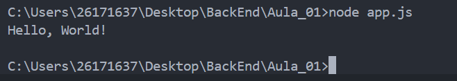

# Meu Primeiro Projeto JavaScript

## Aluno 
Turma: DS1B
Nome: Matheus Oliveira

---

## Sobre

Este projeto foi desenvolvido durante a primeira aula da JavaScript

Objetivo foi aprender:

- ultilizar o VS Code
- executar o JavaScript com Node.js
- ultilizar o terminal
- criar documentação ultilizando o Markdown

## Estrutura

meu-primeiro-projeto

|-app.js
|-informacoes.js
|-operadores.js
|-variaveis

## como executar

Abra o Terminal e execute:

```bash
node app.js
```

## Código

```javascript
console.log("Olá Mundo");
```

## Resultado



---
## Tecnologias
- JavaScript
- Node.js
- Visual Studio Code
- Markdown

## O que aprendi

- criar arquivos em JavaScript
- Executar programas
- Criar README
- Ultilizar Markdown
- Git
- Variavel
- Operadores"# JavaScript" 
